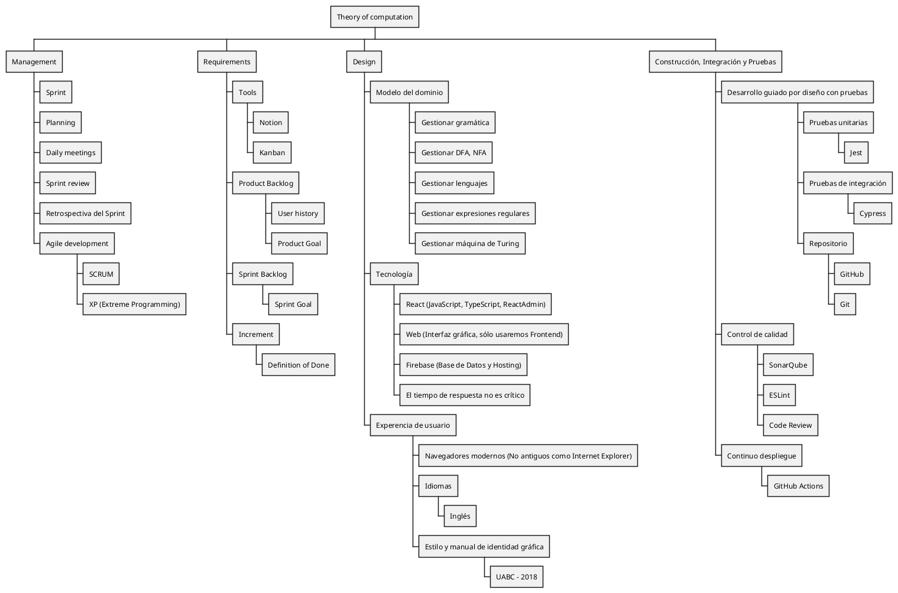

```puml
@startwbs
* Theory of computation

** Management

*** Sprint
*** Planning
*** Daily meetings
*** Sprint review
*** Retrospectiva del Sprint
*** Agile development
**** SCRUM
**** XP (Extreme Programming)


** Requirements

*** Tools
**** Notion
**** Kanban
*** Product Backlog
**** User history
**** Product Goal
*** Sprint Backlog
**** Sprint Goal
*** Increment
**** Definition of Done


** Design

*** Modelo del dominio
**** Gestionar gramática
**** Gestionar DFA, NFA
**** Gestionar lenguajes
**** Gestionar expresiones regulares
**** Gestionar máquina de Turing

***  Tecnología
**** React (JavaScript, TypeScript, ReactAdmin)
**** Web (Interfaz gráfica, sólo usaremos Frontend)
**** Firebase (Base de Datos y Hosting)
**** El tiempo de respuesta no es crítico

*** Experencia de usuario
**** Navegadores modernos (No antiguos como Internet Explorer)
**** Idiomas
***** Inglés
**** Estilo y manual de identidad gráfica
***** UABC - 2018

** Construcción, Integración y Pruebas
*** Desarrollo guiado por diseño con pruebas
**** Pruebas unitarias
***** Jest
**** Pruebas de integración
***** Cypress
**** Repositorio
***** GitHub
***** Git

*** Control de calidad
**** SonarQube
**** ESLint
**** Code Review
*** Continuo despliegue
**** GitHub Actions

@endwbs
```